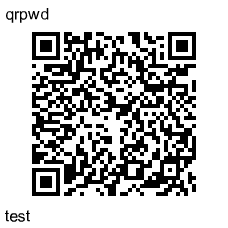

# qrpwd - Encode to QR-Code

A simple command line tool to encode and decode textual information with strong encryption using a given password in a QR code.




Pwd: test - Decode here: https://qrpwd.franzai.com/


- Coded by ChatGpt V4
- Directed by Franz Enzenhofer fe at f19n dot c o m 


---

**Project Motivation**

This project, [qrpwd](https://github.com/franzenzenhofer/qrpwd), was inspired by the need for a secure and convenient way to store 2-factor authentication (2FA) backup codes. The tool allows you to encode and decode information in QR codes, password-protected for added security. Additionally, an [online decoder](https://franzenzenhofer.github.io/qrpwd/) is available for decoding when you're away from your computer or in case of loss.

The idea is to store the encoded QR codes containing the 2FA backup codes in plain sight, such as in an image library, repo, or even as a WhatsApp message to yourself. This approach leverages the fact that images are often backed up multiple times across various locations, ensuring that the 2FA backup codes remain accessible.

We encourage security experts to share their thoughts and opinions on this method's effectiveness and potential improvements.

---

 ## Installation

To install qrpwd, follow these steps:

1. Clone the repository or download the source files.
2. Navigate to the project directory.
3. Run `npm install` to install the dependencies.
4. Run `npm link` to make it a global command line tool.

## Usage

### Encode

To encode a message:

```bash
qrpwd encode -m "your message" -p "your_password" -o output.png
```

To encode a file:

```bash
qrpwd encode -f input.txt -p "your_password" -o output.png
```

### Decode

To decode an encrypted QR code:

```bash
qrpwd decode -i input.png -p "your_password"
```

## Parameters

- `-m` or `--message`: The message to encode.
- `-f` or `--file`: The file to encode.
- `-p` or `--password`: The password to encrypt/decrypt the data (required).
- `-o` or `--output`: The output file for the QR code (default: timestamped .png file).
- `-i` or `--input`: The input QR code image file (required for decoding).

For more information, refer to the [GitHub repository](https://github.com/franzenzenhofer/qrpwd).

To try the qrpwd Online Decoder, visit the [online decode page](https://franzenzenhofer.github.io/qrpwd/).
